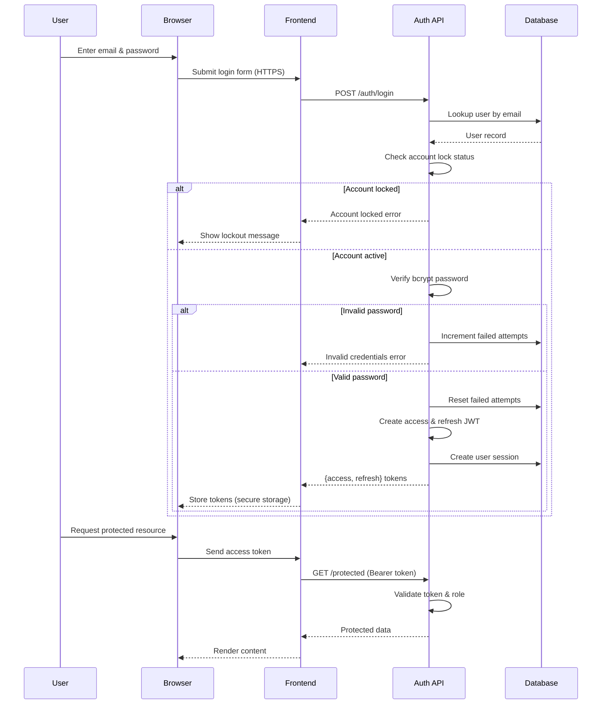
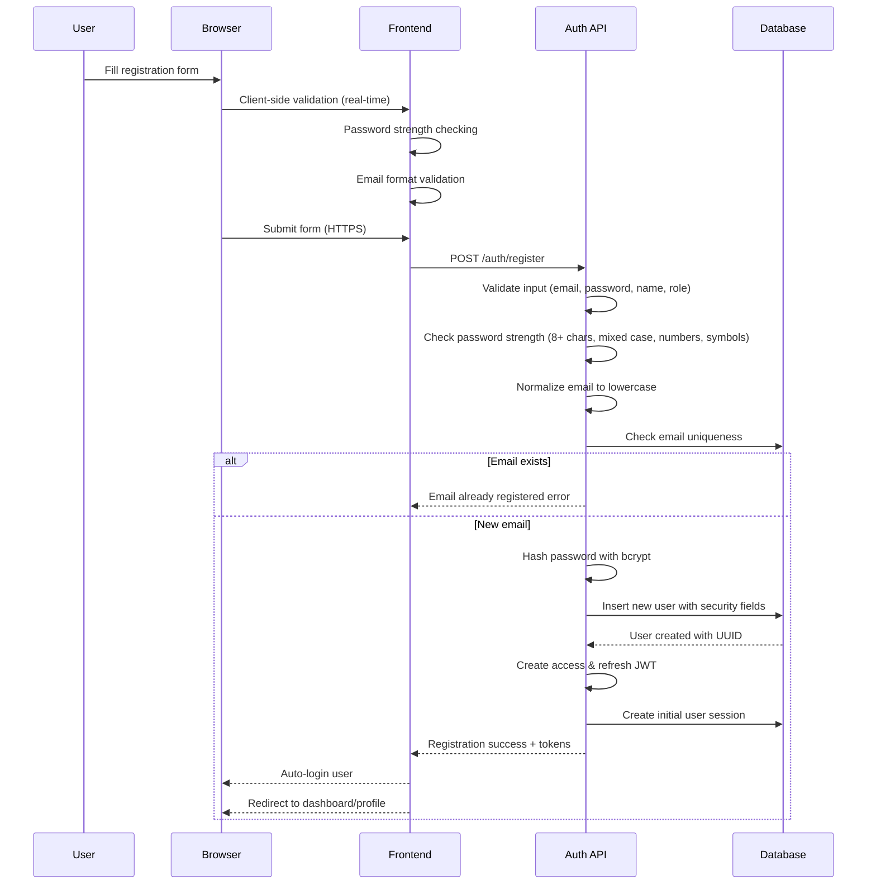
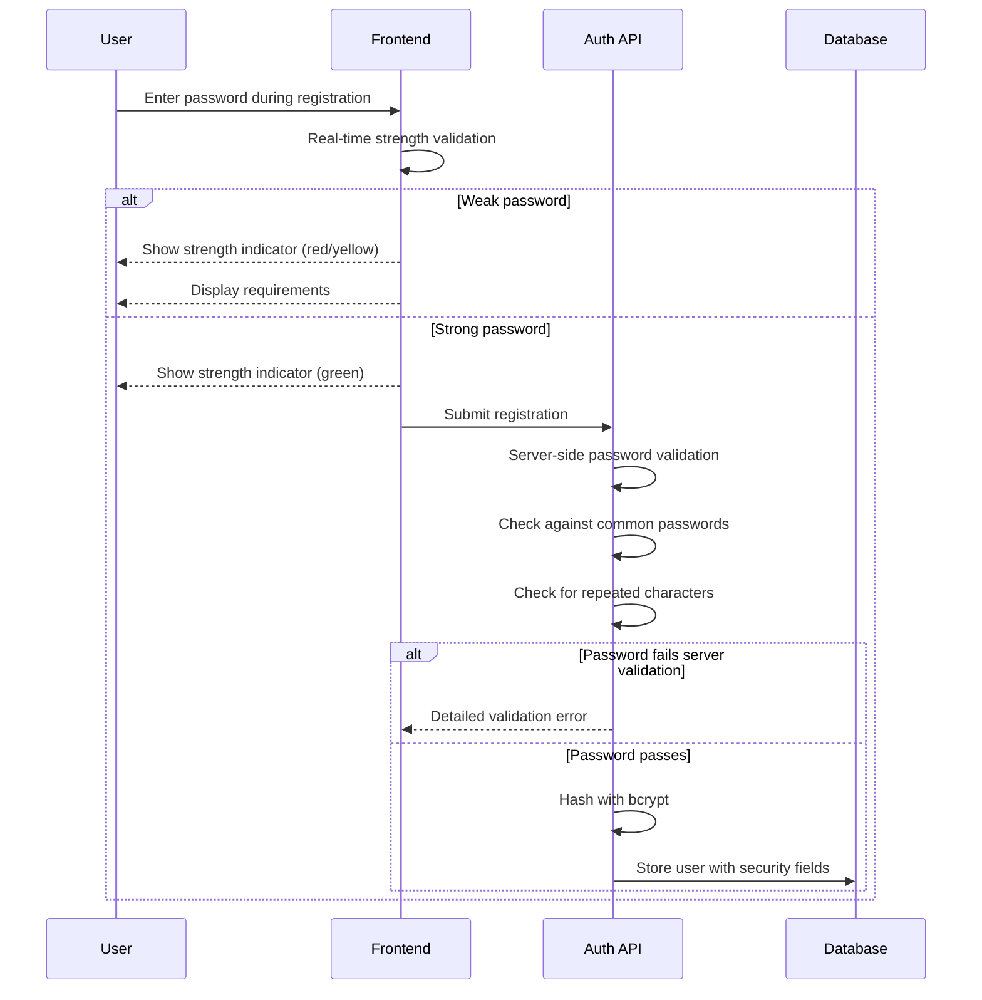

# Authentication & Registration Flows

This document illustrates how the X University application handles user authentication, authorization, and registration. Sequence diagrams use Mermaid notation.

## Login: Authentication & Authorization

**Security considerations:**
- Passwords hashed with bcrypt before comparison.
- Account lockout after 5 failed login attempts for 30 minutes.
- Tokens have short-lived access and refresh expirations with secure storage and rotation.
- Role-based access control enforced on protected routes.
- HTTPS used between browser and frontend to prevent eavesdropping.
- Session tracking for security monitoring.

## Registration

**Security considerations:**
- Emails normalized and stored in lowercase for consistency.
- Strong password requirements: minimum 8 characters, uppercase, lowercase, numbers, special characters.
- Passwords stored as bcrypt hashes with salt rounds.
- Terms of service and privacy policy acceptance tracked with timestamps.
- User profile completion status tracked.
- Password change timestamps for security auditing.
- Failed login attempts counter initialized to 0.
- Email verification status tracked (ready for future implementation).
- Auto-login after successful registration for better UX.

## Password Security Features

## Account Security & Monitoring

- **Account Lockout**: Accounts lock automatically after 5 failed login attempts for 30 minutes.
- **Password Aging**: System tracks when passwords were last changed (ready for forced updates).
- **Session Management**: All user sessions are tracked with creation timestamps.
- **Audit Trail**: Registration includes terms acceptance timestamps and profile completion status.
- **Role-Based Access**: Users can register as students, instructors, or admins with appropriate permissions.

## Missing or Future Enhancements
- Email verification for new accounts (database fields ready).
- Multi-factor authentication.
- Secure refresh token rotation and revocation list.
- Password reset via email verification tokens.
- Advanced audit logging and security monitoring.
- Rate limiting on registration endpoints.
- CAPTCHA integration for bot prevention.
