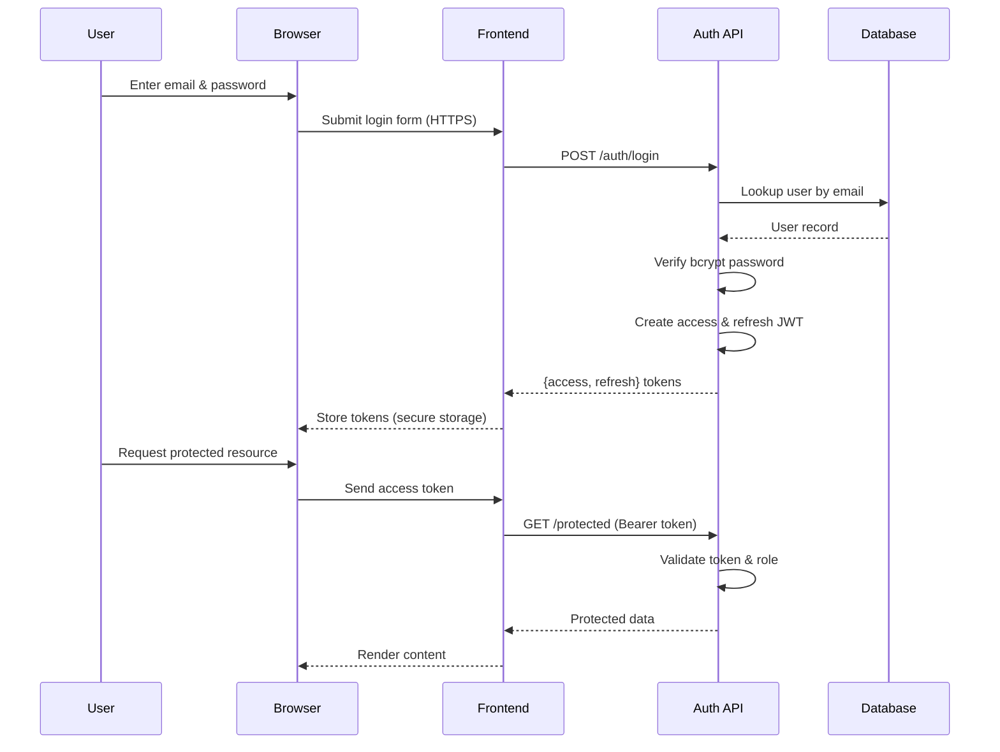
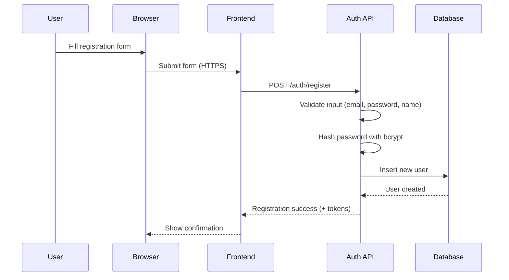

# Authentication & Registration Flows

This document illustrates how the X University application handles user authentication, authorization, and registration. Sequence diagrams use Mermaid notation.

## Login: Authentication & Authorization

**Security considerations:**
- Passwords hashed with bcrypt before comparison.
- Tokens have short-lived access and refresh expirations with secure storage and rotation【F:README.md†L569-L572】
- Role-based access control enforced on protected routes【F:README.md†L574-L577】
- HTTPS used between browser and frontend to prevent eavesdropping.

## Registration

**Security considerations:**
- Emails normalized and stored in lowercase【F:documents-references/sprints/S001_auth.md†L18-L18】
- Passwords must be at least 8 characters and stored as bcrypt hashes【F:documents-references/sprints/S001_auth.md†L18-L18】
- Tokens issued only after successful validation.

## Missing or Future Enhancements
- Email verification for new accounts.
- Multi-factor authentication.
- Account lockout and rate limiting to mitigate brute-force attacks.
- Secure refresh token rotation and revocation list.
- Audit logging and security monitoring.
